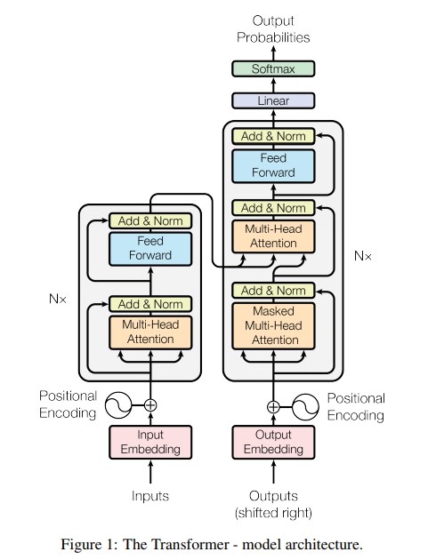
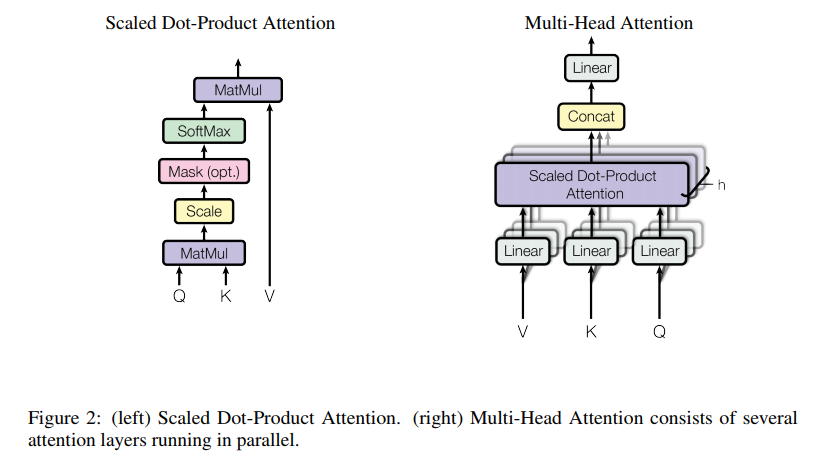
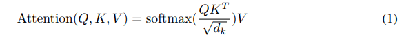
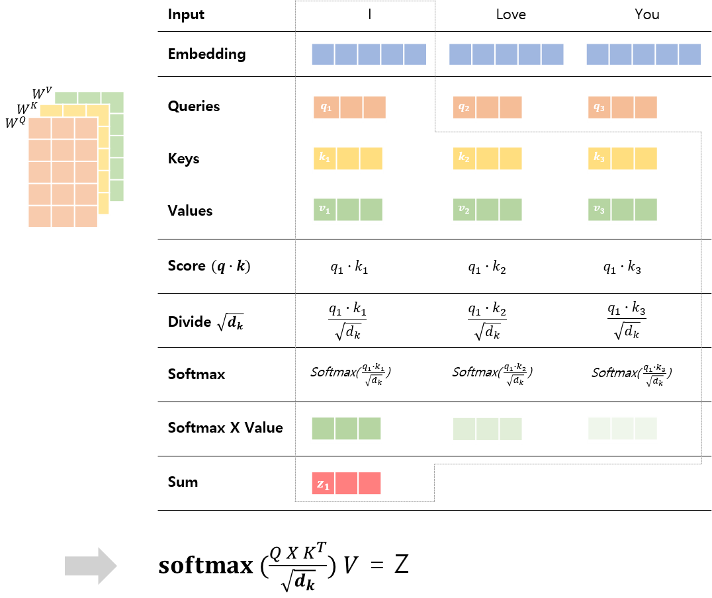

# "Attention is All You Need"  
> 관련 논문 : https://arxiv.org/pdf/1706.03762.pdf  
> Link : http://jalammar.github.io/illustrated-transformer/  
> Link : https://nlpinkorean.github.io/illustrated-transformer/ [번역]  
---
 

## Abstract  
CNN과 RNN을 없애고 Attention Mechanism에 기반을 둔 Transformer(Simple Network)에 대해 제안함  
  
 

## 1. Introduction  

- 참고. RNN의 기본 구조  
  - Sequence Model
  - Hidden_State(t-1)과 Input(t)을 통해 새로운 Hidden_State(t)를 생성함  
  - 따라서, 구조상 Sequential한 특성을 가지고 있기 때문에 Paralleliztion에 취약하다는 단점이 있음

본 논문에서는 RNN 또는 CNN 모델없이 전적으로 Attention Mechanism에 기반을 둔 모델(Transformer)을 구성하였으며, 이로 인해 학습시간이 매우 빠르다는 장점을 갖음
  
 
  
## 2. Background

- 참고 1. Sequential Computation을 줄이기 위한 방법
  - Extended Neural GPU, ByteNet, ConvS2S
  - 이는 Input과 Output의 모든 위치에서 Hidden Representation을 병렬로 처리하기 위해 CNN을 사용함
  - 그러나 distant position들의 dependency를 계산하기에는 수많은 연산이 요구되기 때문에 학습하기 어려움
  
- 참고 2. Self-attention
   - Attention은 전체 또는 특정 영역의 입력값을 반영하여, 그 중 어느 부분에 집중해야 하는지를 나타냄
   - Self-Attention (또는 Intra-Attention)
     - Sequence의 representation을 계산하기 위해서 하나의 Sequence에서 서로 다른 포지션과의 관계를 나타내는 메카니즘
     - 즉, 하나의 문장에서 현재의 단어와 이전 단어들 간의 상관 관계를 학습할 수 있음
     - ex. 문장 이해/요약 등에서 유용함
     
- 본 논문은 RNN이나 CNN 없이 Self-Attention만 사용한 Transformer 구조에 대해서 설명하며, 이 구조의 장점에 대해서 이야기하고자 함  
  
 

## 3. Model Architecture
- Overall Model Architecture of Transformer  
  모델의 전반적인 구조는 아래와 같이, 크게 Encoder와 Decoder로 구성되어 있음
  

### 3-1. Encoder and Decoder Stacks
#### 1) Encoder
- 각각의 Layer는 두가지 sub-layer로 구성되어 있음 (multi-head self-attention +  fully connected feed-forward network)
- 각각의 sub-layer는 residual connection과 이를 Normalization하는 부분으로 구성되어 있음

#### 2) Decoder
- 기존 Encoder와 동일한 두가지 sub-layer 외 한가지 sub-layer를 추가함 (즉, sub-layer로 구성되어 있음)
- Masked multi-head self-attention + multi-head self-attention +  fully connected feed-forward network
- encoder와 마찬가지로 각각의 sub-layer는 residual Connection 및 Normalization 을 수행함
- Maksing을 통해, 포지션 i의 prediction이 i보다 하위 포지션에 있는 output에만 의존할 수 있도록 함

### 3-2. Attention
- Attention은 Query 및 key-value Pair를 토대로 output을 매핑
- output은 Value의 weighted sum으로 계산함
- 각각의 Value의 weight 값은 Query-이에 상응하는 key의 compatability function에 의해 계산 가능함
 
   

#### 1) Scaled Dot-Product Attention
- Input은 Query, Key, Value로 구성
- Q, K, V를 통한 dot-product 및 Softmax 등의 연산 과정을 통해 Value의 weight 값을 계산
- The matrix of outputs as:
    
  
   
- __Self Attention 계산 과정__
  
   
  - STEP 1. Query, Key, Value Vector 생성
  - STEP 2. Score 계산 (Encoding 시 다른 단어들에 대해서 얼마나 집중 해야 할지를 결정함)
  - STEP 3. Score 값을 Root(Dimension Of Key)로 나눠줌
  - STEP 4. Softmax를 취함
  - STEP 5. STEP5에서 구한 Softmax 값과 Value 값을 곱함 (Weighted Value)
  - STEP 6. Weighted Value 벡터들을 모두 더함

#### 2) Multi-Head Attention

#### 3) Applications of Attention in our Model

 

## 참고 자료
1) Attention Mechanism 관련 자료
> https://www.youtube.com/watch?v=6aouXD8WMVQ  
> https://yjucho1.github.io/attention/attention/  

