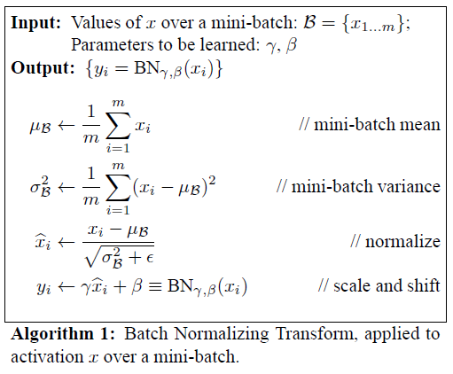
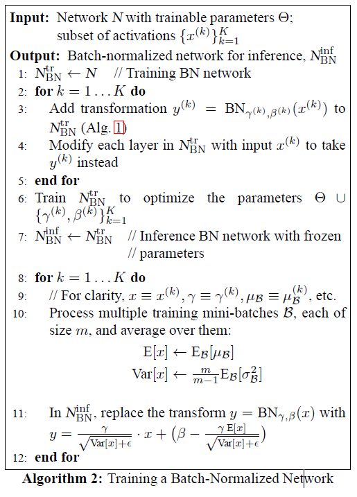
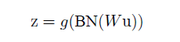
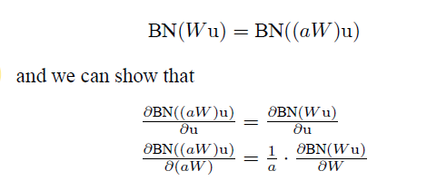

# Batch Normalization Accelerating Deep Network Training by Reducing Internal Covariate Shift
> Link : https://arxiv.org/pdf/1502.03167.pdf
---
 

### 1. Introduction

 
 
### 2. Towards Reducing Internal Covariate Shift
 

### 3. Normalization via Mini-Batch Statistics  
1) 각각의 Scalar Feature를 정규화함 (mean:0, variance:1)  
   즉, 각각의 d-dimension input x=(x1, ...., xd)에 대해서 Standardization 수행  
   - 그러나, 각각의 Input에 대해 Standardization 수행 시 layer가 표현하고자 하는 것을 제대로 표현하지 못할 수 있음.  
     ex) non-linear한 Sigmoid 함수에서 0 ~ 1 영역은, linear한 특성을 보임 (optimize한 결과를 보장하지 못함)  
     
   - 따라서, transformation을 추가 (identity transform 표현 가능)  
     gamma 및 beta는 scale 및 shift를 조정하기 위한 parameter임  
       
     
2) Mini-Batch 이용  
   각각의 mini-batch는 mean, variance를 추정 가능함.

- __BN transform__  
 
     
  - sub-network의 Input은 고정된 mean(0), variance(1) 값을 가짐   
  - Model 학습 시 Internal covariance shift 영향이 적은 input distribution을 계속 학습할 수 있음  
    따라서, 학습을 가속화시킴 

  - BN Transform을 통해 identity transformation을 표현 가능함.
    - gamma : (Var[x_k])**0.5  / beta: E[x_k]

#### 3.1 Training and Inference with Batch-Normalized Networks  

   

- Batch Normalization Network & Training  

- cf) 기존 Network  

#### 3.2 Batch-Normalized Convolutional Networks  

 - W, b : 학습 parameter
 - g(.) : non-linearity function (ex. sigmoid, ReLU)

#### 3.3 Batch Normalization enables higher learning rates
- too-high learning rate: gradient issue(exploding 또는 vanishing gradient) 또는 local minima issue를 발생시킴  
- 그러나, activation의 normalizing을 통해 non-linearity 영역에서 saturated 영역에 갇히는 것을 방지  
  (gradient == 0인 지점으로 가는것을 막아줌)  
- large learning rate: layer parameter들의 scale을 증가시킴 (backpropagation 시, gradient를 증폭시키기 때문에)
- 그러나, BN은 parameter scale에 영향을 끼치지 않음  

#### 3.4 Batch Normalization regularizes the model 
- Network Generalization 효과
- Overfitting을 막기위해 drop out 기법을 사용하나, BN에서는 drop out을 사용하지 않거나 strength를 줄일 수 있음

 
### 4. Experiments
