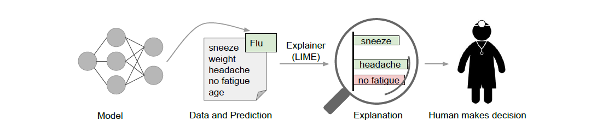
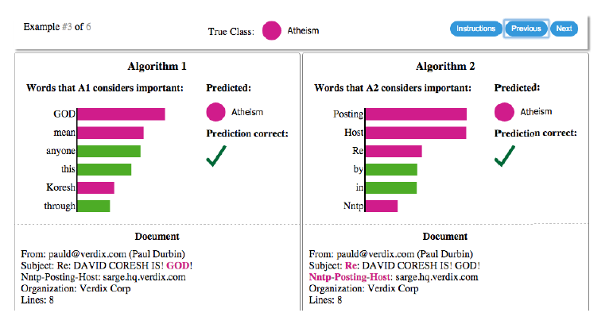

# “Why Should I Trust You?” Explaining the Predictions of Any Classifier 
> Link : https://www.kdd.org/kdd2016/papers/files/rfp0573-ribeiroA.pdf
---
 

### 1. Introduction
- Machine Learning의 Model이 복잡해질수록 예측 정확도는 올라가지만 예측 결과를 해석하는 것은 매우 어려움  
  → 'Black Box'로 불림
- 새로운 모델을 deploy하거나 예측 결과를 기반으로 어떤 액션을 취하기 위해서는 model를 이해하는 것이 매우 중요함  
  즉, model을 이해할 수 있어야지만 예측 결과 또는 모델을 신뢰할 수 있음.
  
- 이 논문에서는 model에 대한 'Trust'를 아래 두가지로 설명함  
  1. trusting a prediction:  
     - 개별 예측에 기반하여 user가 어떤 액션을 취할수 있도록 함  
     - 예를 들어 의료 진단이나 테러리스트 탐지를 위해 ML 기법을 사용할 때, Model의 맹목적 신뢰로 예측 결과를 판단하면 안됨.  
  2. trusting a model:  
     - model을 deploy하는 것에 대해서 reasonable한 이유를 제공함  
     - model을 'in the wild'에 배포하기 전에 'real world'에서도 model이 잘 동작하는 지 평가해야함  
        그러나 real world의 데이터는 보통 다를수 있기 때문에 evaluation metric이 product의 목표가 될 수 없음
 
- 따라서, 위의 두가지 'Trust' 문제를 해결하기 위해 논문에서는 2가지 방법론을 제시함  
  1. LIME(Local Interpretable Model-agnostic Explanations):  
     - 모델의 개별 예측값을 설명하기 위한 알고리즘
     - 해석 가능한 모델(simple model)을 통해 locally approximation을 수행함으로써 예측 결과를 설명함
  2. SP-LIME:
     - 모델 자체의 신뢰성을 해결하기 위해 설명력있는 representative instance를 선택하는 방법
     - 중요 정보를 담고 있는 소수의 인스턴스를 추려내기 위한 과정

### 2. The Case for Explanations
- "Explaning a Prediction" 이란?  
   - instance component (ex. 텍스트 단어/이미지 patch)와 model의 예측 사이의 관계를 이해할 수 있도록 정보를 제공하는 것
 
- __예시 1. 모델이 특정 환자가 독감에 걸렸다고 예측__
  
     - Explainer(LIME)이 결과를 예측할 때 가장 중요했던 증상을 강조하며 모델을 설명
     - (GREEN) 독감을 판단하는 중요 인자 (RED) 그에 반하는 증거
     - 의사는 모델의 예측 결과를 신뢰할지 말지에 대한 결정할 수 있음   
   - 즉, 예측 결과를 판단하게된 정보를 제공한다면 모델의 도움을 받아 의사결정을 하는 것이 유리함
   
   
 - __예시 2. "Christianity" 또는 "Atheism" 분류__
   
     - 알고리즘1/2에서 'Athenism'으로 판단한 관련성 높은 단어를 보여줌(magenta)
     - 각각 모델의 예측에 대한 설명을 더해준다면 어떤 알고리즘이 정확하게 판단했는지 알수 있음
     - (이 결과는 Accuracy와 같은 metric과 일치하지 않을 수 있음)
     - 그러나 모델이 예측함에 있어서 어떤 인자가 중요하게 영향을 끼쳤는지에 대한 정보를 알수 있음
  
- "In the Wild"에서 모델의 신뢰성 평가는 "Real World"와 다르게 과대 측정되는 경우가 많음
- 따라서, "Explaner"을 통해 다른 대안이 될 수 있는 방안을 제시함 

- 참고. 잘못된 모델 평가를 일으키는 원인
  1. Data Leakage: 
     - 의도치 않은 잘못된 시그널이 Train/Validation 데이터 셋에 포함되는 경우
     - 모델은 의미없는 패턴을 학습하게 됨
     - 이 경우, 모델 예측에 대한 설명 정보가 제공된다면 쉽게 찾을 수 있음 (Figure 1)
  2. Dataset Shift: 
     - Test 데이터 셋의 특성이 Train 데이터 셋과 다른 경우
 
 ### 3. Local Interpretable Model-Agnostic Explanations. 
 
 
  
