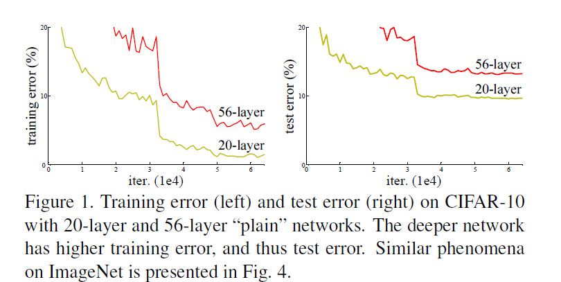

# Deep Residual Learning for Image Recognition 
> Link : https://arxiv.org/pdf/1512.03385.pdf
---
 

## Abstract
- __요약__
  - Residual Network는 optimize하기 쉽고, depth가  커어져도 성능을 얻을 수 있음! 
  - cf. depth는 visual recognition task에서 매우 중요
- __평가방법__
  - ImageNet Dataset 
  - 152 layer depth (cf. VGG Net보다 8배 깊음, 그럼에도 VGG보다 낮은 complexity를 지님)
  - 3.57% error
 

## 1. Introduction
- Deep convolutional Neural Network가 image classification에 획기적인 발전을 가져왔음  
  Network의 depth가 중요함 !  
  why ?  depth의 깊이에 따라 feature의 level(low/mid/high) 이 다양해 질 수 있기 때문  
  
- Layer를 쌓는것 만큼이나 Network를 학습하는게 쉬울까 ?  
  Layer를 쌓는건 쉬운데, Layer를 쌓는다고 해서 Network가 그만큼 잘 학습이 잘 될까?
  - __No__, Vanishing/Exploding Gradient
  - __Vanishing/Exploding Gradient 해결방안__ : Normalized initialization, Batch Normalization  
  
- degradation problem : Network의 depth가 증가할 때, accuracy는 saturated되고 degrade가 발생  
    
  - 위의 그림에서 볼때 degradation 문제는 overfitting에 의한 것이 아님
    (20-layer model에 layer를 더 추가한 56-layer model의 Train/Test error가 20-layer model 보다 높은 것을 볼 수 있음)  

- Learned shallower model + identity mapping로 Deeper Model를 구축
  - Deeper Model은 shallower model보다 training error가 높아서는 안되지만
  - Deeper Model은 적절한 solution을 찾지 못함, 즉 identity mapping을 학습하기는 쉽지 않다 ?
  
 - 그래서, degradation 문제를 해결하기 위해 __Deep residual Learning__ framework 제안
   - Residual mapping : F(x) = H(x) - x  
     Identity mapping을 fitting하는 것보다 Residual mapping을 0으로 optimize 하는 것이 더 쉬움
   - shortcut connection : F(x) + x  
     Identity shortcut connection은 추가 parameter 및 computational complexity가 없음 
 

## 3. Deep Residual Learning 
### 3.1 Residual Learning
- residual function : F(x) = H(x) - x 
- F(x)는 output과 input의 잔차를 학습함, 따라서 이를 Residual Learning이라 칭함
- H(x)를 직접적으로 학습시키는 것 보다, identity mapping을 통해 F(x)를 학습시키는 것이 더 쉬움
  즉, F(x)는 잔차만 학습

### 3.2 Identity Mapping by Shortcuts
- element-wise addition : F(x) + x  
  즉,  F(x)의 출력 dimension과 x의 dimension은 동일해야 함  
  
- F(x)의 dimension과 x의 dimension이 다른 경우 ?  
  - linear projection Ws :  F(x) + WsX
  - shortcut connection x의 dimension을 맞춰줌
  
- F의 경우 2 또는 3개, 그 이상의 Layer를 쌓는 것이 좋음  
  (Why? F가 하나의 Layer만 갖는 경우 Residual Network에 대한 이득이 없음, y =Wx + x  = (W+1)x)
  
- F는 fully-connected Layer, Convolutional layer 등을 사용할 수 있음  

### 3.3 Network Architectures
- Plain network  
VGG nets vs Plain Network vs Residual Network  
VGG net 보다 적은 fileter를 사용하고 낮음 complexity를 보여줌  

- Residual Network  
  - Plain network에서 shortcut connection을 통해서 Residual Network를 구성함
  - Input과 Output이 같은 dimension인 경우 
  - dimension이 증가한 경우, 아래 option을 통해 dimension을 같게 맞춰줌
    - (A) zero padding
    - (B) Projection shortcut 

### 3.4 Implementation
